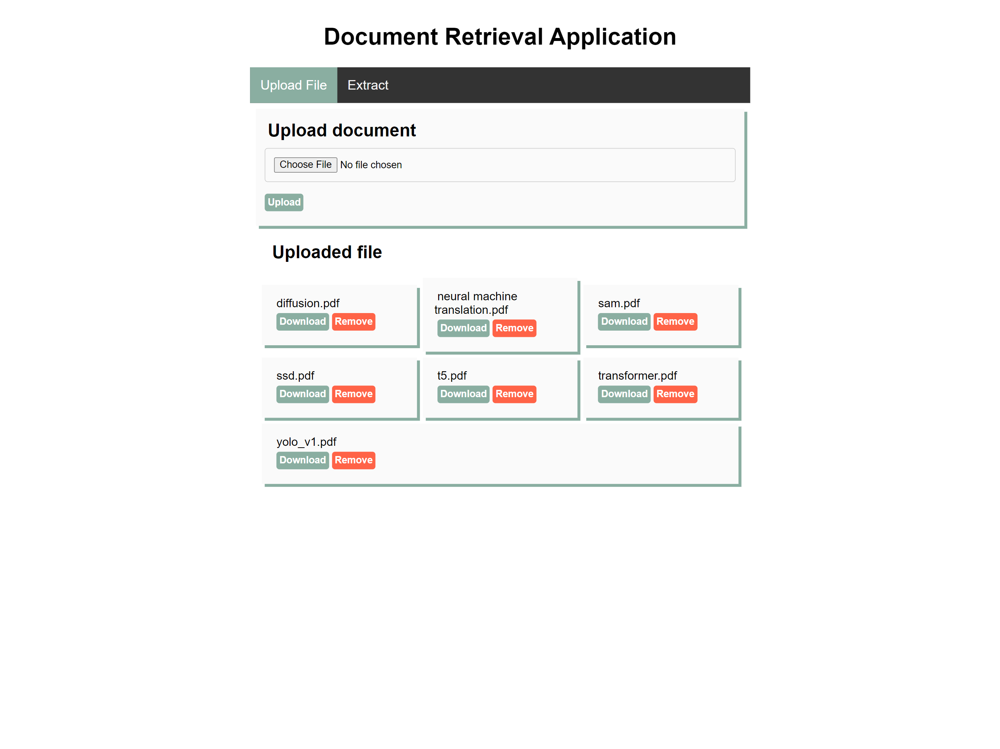
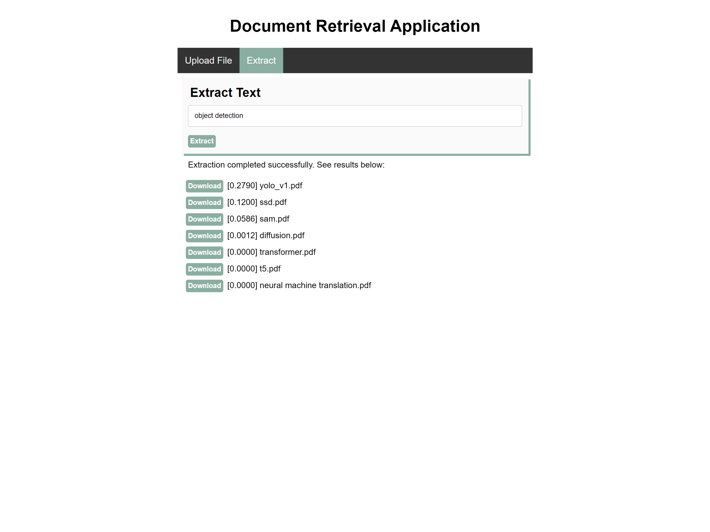

# Document Retrieval Application

This is a simple document retrieval application built with Flask that allows users to upload PDF files and query the stored documents using a basic frontend. The application uses TF-IDF and cosine similarity to find relevant documents based on the user's query.

## Table of Contents

- [Features](#features)
- [Requirements](#requirements)
- [Installation](#installation)
- [Usage](#usage)
- [Project Structure](#project-structure)
- [API Endpoints](#api-endpoints)
- [Future Improvements](#future-improvements)

## Features

- **Upload PDF Documents**: Users can upload PDF files to the server, which are stored in the specified directory.
- **Text Extraction**: Extracts text from stored PDF documents.
- **Query Search**: Users can submit a query to find similar documents based on the content using TF-IDF vectorization and cosine similarity.
- **Simple Frontend**: Minimal HTML interface to upload documents and search for relevant documents.

## Requirements

- Python 3.8+
- Flask
- PyPDF2
- scikit-learn
- nltk (for preprocessing)

## Installation

1. Clone the repository:

   ```bash
   git clone https://github.com/thanhtung4work/tfidf_retrival.git
   ```

2. Run docker

   ```
   docker compose up
   ```

## Demo images



